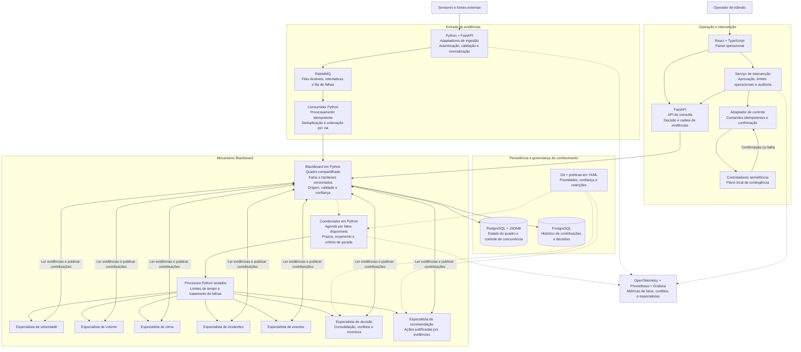
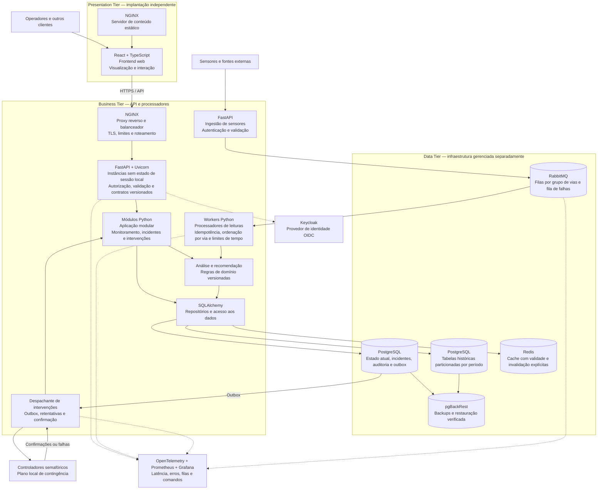

# Arquiteturas para gerenciamento de trânsito

Propostas de evolução conceitual do laboratório. Os componentes abaixo não estão todos implementados no protótipo. Cada proposta enfatiza um desafio diferente; os estilos podem ser combinados. As tecnologias nomeadas são exemplos de implementação, não dependências obrigatórias nem componentes já instalados no laboratório.

Nos diagramas, setas contínuas representam chamadas ou fluxo de dados; setas pontilhadas representam consulta auxiliar, controle ou telemetria. Subgrupos indicam responsabilidades, não necessariamente processos separados, exceto quando identificados como tiers de implantação.

## 1. Blackboard — análise colaborativa entre especialistas

**Cenário:** decisões que combinam sensores, clima, incidentes e eventos, com especialistas independentes e evidências potencialmente conflitantes.

**Características e benefícios:** especialistas dependem do contrato do quadro, sem chamar diretamente uns aos outros. O coordenador agenda a decisão após as evidências exigidas estarem disponíveis ou após um prazo, explicitando análise incompleta. Cada contribuição preserva autoria e versão para reconstruir a decisão.

**Limitações e trade-offs:** a flexibilidade exige políticas de coordenação e resolução de conflitos. O quadro pode se tornar um gargalo; particioná-lo por região ou via dificulta análises que dependem de múltiplas regiões. Distribuir especialistas acrescenta custo de comunicação e consistência; não é obrigatório começar com processos separados.

**Tratamento de falhas:** evidências vencidas não devem ser tratadas como atuais. Um especialista indisponível pode resultar em recomendação com confiança reduzida ou em ausência de recomendação, conforme política explícita. Indisponibilidade da análise não deve impedir o plano local dos semáforos.

## 2. MVC — aplicação operacional como monólito modular

**Cenário:** aplicação centrada nas interações dos operadores, com telas e fluxos em evolução e regras de domínio que precisam permanecer testáveis.

```mermaid
flowchart TB
    Operator["Operador"]
    Identity["Keycloak<br/>Provedor de identidade OIDC"]
    Sensors["Fontes de sensores"]

    subgraph UI["View — apresentação"]
        Views["Thymeleaf + HTML/CSS<br/>Dashboard, incidentes e intervenções<br/>Apresentação e validação de experiência"]
        ViewModels["Modelos de apresentação<br/>Formatação de resultados"]
    end

    subgraph Monolith["Spring Boot / Java — monólito modular"]
        Security["Spring Security<br/>Autenticação, autorização e validação"]
        Controllers["Spring MVC<br/>Controllers enxutos<br/>Traduzem requisições em casos de uso"]
        Presenter["Apresentadores<br/>Traduzem resultados para a View"]

        subgraph Application["Aplicação — coordenação dos casos de uso"]
            Monitor["Consultar e analisar trânsito"]
            IncidentUC["Registrar e acompanhar incidente"]
            InterventionUC["Propor, aprovar e acompanhar intervenção"]
        end

        subgraph Domain["Model — módulos de domínio"]
            Traffic["Monitoramento<br/>Vias, leituras e regras de congestionamento"]
            Incidents["Incidentes<br/>Ocorrências, prioridades e ciclo de vida"]
            Interventions["Intervenções<br/>Restrições, aprovação e estado do comando"]
            Ports["Portas de persistência e integrações<br/>Contratos definidos pelo núcleo"]
        end

        subgraph Infrastructure["Adaptadores de infraestrutura"]
            Repositories["Spring Data JPA + Hibernate<br/>Repositórios e transações"]
            Ingestion["Adaptador de sensores<br/>Validação e deduplicação"]
            Outbox["Worker Java / Spring<br/>Publicador de outbox<br/>Retentativas e entrega idempotente"]
            Control["Adaptador de controle semafórico"]
        end
    end

    DB[("PostgreSQL<br/>Dados por módulo, auditoria e outbox")]
    Signals["Semáforos<br/>Confirmação e contingência local"]
    Observability["OpenTelemetry + Prometheus + Grafana<br/>Telemetria por operação"]

    Operator --> Views --> Security --> Controllers
    Security -.-> Identity
    Controllers --> Monitor & IncidentUC & InterventionUC
    Monitor --> Traffic
    IncidentUC --> Incidents
    InterventionUC --> Interventions
    Monitor & IncidentUC & InterventionUC -->|"Resultados"| Presenter
    Presenter --> ViewModels --> Views
    Traffic & Incidents & Interventions --> Ports
    Ports --> Repositories --> DB
    Sensors --> Ingestion --> Monitor
    DB -->|"Eventos confirmados na transação"| Outbox
    Outbox --> Control --> Signals
    Signals -->|"Confirmações"| Control
    Control --> InterventionUC
    Controllers -.-> Observability
    Repositories -.-> Observability
    Outbox -.-> Observability
```

**Características e benefícios:** MVC organiza a interação; módulos de domínio e casos de uso organizam o restante da aplicação. Controllers não concentram regras de negócio. Cada módulo controla seus dados e expõe operações explícitas aos demais. As setas de portas para adaptadores representam chamadas em execução; no código, os adaptadores implementam os contratos definidos pelo núcleo.

**Limitações e trade-offs:** uma implantação conjunta simplifica a operação e permite transações locais, mas também une ciclos de release e capacidade. Fronteiras de módulos precisam ser preservadas para evitar um monólito fortemente acoplado. Réplicas são possíveis, desde que sessões, tarefas e estado compartilhado sejam tratados adequadamente.

**Tratamento de falhas:** a intenção de intervenção e seu evento de outbox são gravados na mesma transação. A entrega externa pode ser repetida; comandos precisam de identificadores idempotentes. Uma aprovação não significa que o dispositivo executou a ação: o domínio registra separadamente aprovação, envio, confirmação e falha.

## 3. Multitiers — implantação e capacidade por responsabilidade

**Cenário:** múltiplos clientes, alto volume de leituras e necessidades diferentes de capacidade entre apresentação, processamento e persistência.

**Características e benefícios:** apresentação, negócio e dados têm fronteiras de implantação explícitas. APIs atendem interações enquanto processadores absorvem o fluxo de sensores. Os componentes do Business Tier podem começar em uma base de código modular; o diagrama não exige um microsserviço para cada caixa.

**Limitações e trade-offs:** filas absorvem picos, mas tornam o processamento assíncrono e podem aumentar a defasagem. Cache reduz consultas, mas requer política de validade. Múltiplas instâncias ampliam capacidade apenas se o banco, as partições e outras dependências suportarem a carga. Infraestrutura adicional aumenta custo operacional e exige observabilidade.

**Tratamento de falhas:** a interface apresenta o horário da última leitura e seu estado de atualização. Retentativas têm limite, mensagens problemáticas seguem para análise e operações não são presumidas como entregues exatamente uma vez. Backups precisam de exercícios de restauração. Comandos sem confirmação devem permanecer pendentes ou falhos, conforme política de prazo.

## Comparação para o seminário

| Dimensão | Blackboard | MVC modular | Multitiers |
|---|---|---|---|
| Problema central | Combinar conhecimento especializado | Organizar interação e regras | Separar implantação e capacidade |
| Benefício principal | Evolução independente de especialistas | Manutenção e testes por responsabilidade | Capacidade ajustável por parte do sistema |
| Custo principal | Coordenação e consistência do quadro | Disciplina modular e release conjunto | Comunicação, operação e falhas parciais |
| Primeiro sinal para evoluir | Novas fontes e hipóteses conflitantes | Controllers extensos e módulos acoplados | Gargalos distintos de ingestão, API e dados |
| Evidência necessária | Qualidade e rastreabilidade das decisões | Custo e alcance das mudanças | Medições de carga, latência e disponibilidade |

**Composição possível:** uma implantação Multitiers pode conter uma aplicação MVC no atendimento às interações e um mecanismo Blackboard no processamento de análises. A maturidade está em justificar cada componente e testar seus modos de falha, não em adotar todos os componentes de uma vez.

## Tecnologias e decisões de implementação

| Responsabilidade | Exemplo escolhido | Papel na proposta |
|---|---|---|
| Mensageria | RabbitMQ | Transportar leituras até os consumidores; o broker não substitui o quadro Blackboard. |
| Persistência | PostgreSQL | Armazenar estado, histórico, incidentes e outbox. JSONB acomoda os fatos do quadro, com contratos validados pela aplicação. |
| Aplicação Blackboard | Python + FastAPI | Implementar especialistas, coordenador e API de consulta. O mecanismo de conhecimento é código da aplicação. |
| Aplicação MVC | Spring Boot + Spring MVC + Thymeleaf | Exemplo explícito de Controllers Java e Views renderizadas no servidor. Domínio e casos de uso permanecem separados do framework. |
| Aplicação Multitiers | React + FastAPI + SQLAlchemy | Separar apresentação, serviços HTTP e acesso aos dados. |
| Cache | Redis | Manter cópias temporárias de consultas; PostgreSQL permanece como fonte de verdade. |
| Identidade | Keycloak | Centralizar identidade; permissões de negócio continuam sendo verificadas pela aplicação. |
| Entrada web | NGINX | Servir arquivos e encaminhar chamadas para instâncias da API. |
| Observabilidade | OpenTelemetry + Prometheus + Grafana | Instrumentar a aplicação, coletar métricas e apresentar painéis. Persistir logs e traces exigiria backends adicionais, como Loki e Tempo. |
| Backup | pgBackRest | Operar backups PostgreSQL para um repositório separado, com testes de restauração. |

**RabbitMQ:** configurar durabilidade das filas, persistência das mensagens, confirmação de publicação e reconhecimento após processamento. Deduplicação continua sendo responsabilidade dos consumidores. Ordenação por via exige roteamento consistente para filas e execução serial por chave; consumidores concorrentes e reentregas podem alterar a ordem observada. Essas propriedades não surgem apenas por adicionar o broker. Veja a [documentação de filas do RabbitMQ](https://www.rabbitmq.com/docs/queues).

**PostgreSQL:** estado e histórico nos diagramas representam responsabilidades lógicas; podem começar na mesma instância, com tabelas ou schemas separados. Não é necessário criar um banco independente para cada caixa. O [tipo JSONB do PostgreSQL](https://www.postgresql.org/docs/current/datatype-json.html) permite representar fatos sem tornar todo o modelo relacional genérico.

**MVC:** Spring MVC é uma escolha ilustrativa para explicitar esse padrão, conforme sua [documentação oficial](https://docs.spring.io/spring-framework/reference/web/webmvc.html). A troca de linguagem em relação ao protótipo não é requisito de maturidade; a arquitetura também poderia permanecer em Python.

**Observabilidade:** [OpenTelemetry](https://opentelemetry.io/docs/what-is-opentelemetry/) instrumenta e exporta sinais; não é, por si só, o armazenamento ou a interface de consulta desses sinais. Os diagramas resumem o conjunto de ferramentas em uma caixa para manter o foco arquitetural.
